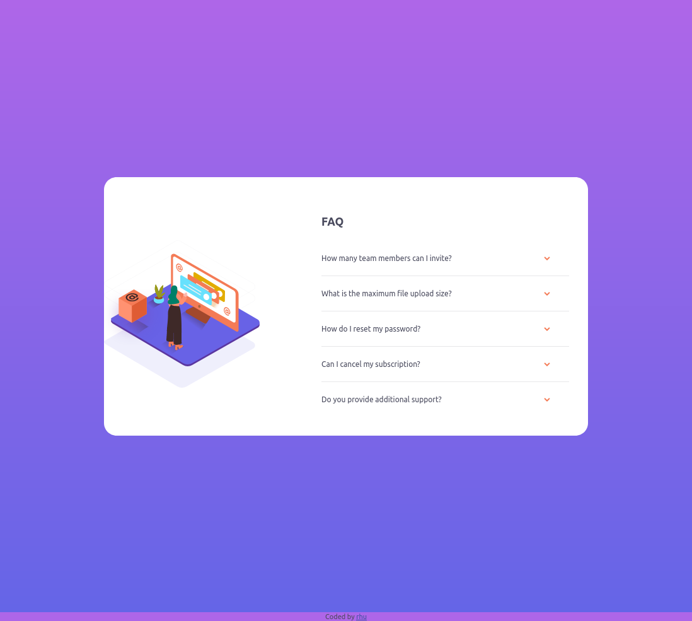

# Frontend Mentor - FAQ accordion card solution

This is a solution to the [FAQ accordion card challenge on Frontend Mentor](https://www.frontendmentor.io/challenges/faq-accordion-card-XlyjD0Oam). Frontend Mentor challenges help you improve your coding skills by building realistic projects. 

## Table of contents

- [Overview](#overview)
  - [The challenge](#the-challenge)
  - [Screenshot](#screenshot)
  - [Links](#links)
- [My process](#my-process)
  - [Built with](#built-with)
- [Author](#author)
- [Acknowledgments](#acknowledgments)

## Overview
Create an accordion menu FAQ page

### The challenge

Users should be able to:

- View the optimal layout for the component depending on their device's screen size
- See hover states for all interactive elements on the page
- Hide/Show the answer to a question when the question is clicked

### Screenshot

### Links

- Live Site URL: 

## My process
Built the site mobile first. Create the HTML markup, and added the styles for the accordion menu. Tied it up with some Javascript for the dropdown toggle effect.

### Built with

- Semantic HTML5 markup
- CSS custom properties
- Flexbox
- Mobile-first workflow
- Javascript

## Author

- Website – rhu - https://github.com/rhulog
- Twitter - @rhuminations - https://twitter.com/rhuminations

## Acknowledgments

I want to thank Front End Mentor for creating this challenge and giving me a chance to exercise my skill.
